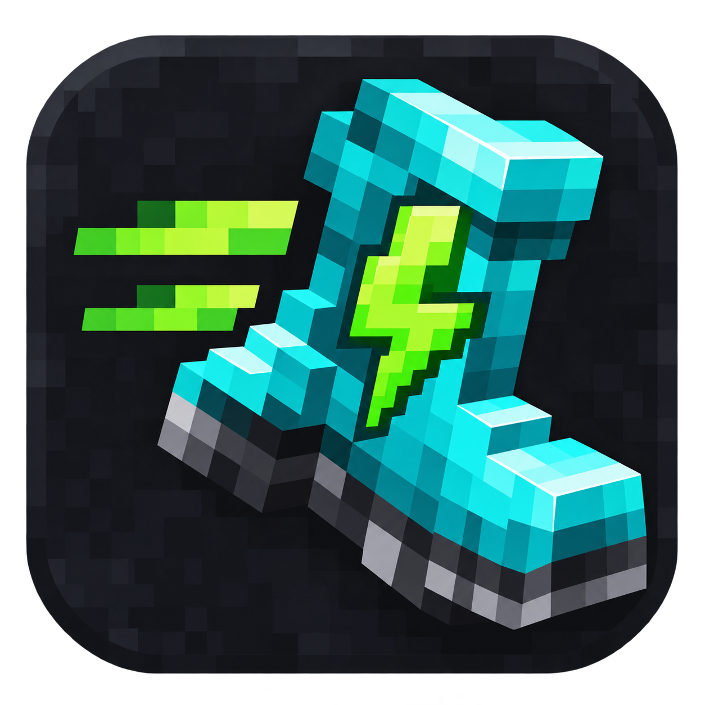

# Minecraft Bedrock Auto Sprint



A small Windows tray helper for Minecraft Bedrock. Hold **W** and the helper also
holds **I**, your configured sprint key. Release W and it releases the extra I press.

## Use

1. Download `BedrockAutoSprint.exe` from this repository. On its file page, use
   **Download raw file**.
2. In Minecraft Bedrock's keyboard settings, set **Sprint** to **I**. Remove any
   conflicting I binding.
3. Run the EXE. It starts enabled. Hover over its system tray icon to see ON/OFF.
4. Press **F8** to pause or resume. Release W and press it again after resuming.
5. Right-click the tray icon and choose **Exit** to close it.

**Pause with F8 before typing in Minecraft chat, search fields, or menus.** The
helper cannot distinguish gameplay from text entry, so W otherwise adds I there.

Only the focused process named `Minecraft.Windows` activates the extra input.
This name was verified for the author's Bedrock installation. Java's usual
`javaw` process does not match. F8 remains a global shortcut while the helper runs.

## Behavior and limitations

- Duplicate launches are blocked; only one copy installs a keyboard hook.
- The helper releases I on W release, pause, normal exit, and loss of game focus.
  Focus is checked every 50 ms. There can still be a small race during a switch
  between windows because Windows input injection is desktop-wide.
- Force-closing or crashing the helper bypasses normal cleanup. If I appears
  stuck, tap and release I.
- Physical I presses, other keyboard remappers, unusual keyboard layouts, and
  different privilege levels can affect behavior. Run the game and helper at
  the same permission level; administrator rights are not requested.
- Server rules may restrict input macros. Check the rules before using it there.
- The binary targets x64 Windows with .NET Framework 4, normally available on
  Windows 10/11. It is unsigned, so Windows may display a warning.

## Privacy and security

The production source uses a Windows low-level keyboard hook to react to W/F8,
checks the focused process, and sends simulated I input. It does not log or save
keystrokes, use the network, edit game files, register for startup, or launch
child processes.

State-transition, input-failure, duplicate-launch, F8 repeat, startup, icon, and
normal-shutdown tests passed. Actual gameplay is not covered by these tests.
Source review and passing tests are not an antivirus certification.

## Build

From PowerShell in the repository directory:

```powershell
.\build.ps1
```

The script uses the .NET Framework C# compiler bundled with Windows and embeds
`BedrockAutoSprint.ico`. No NuGet packages are needed. Close the running helper
before overwriting its executable.

## Test

Exit the helper first, then run:

```powershell
.\test.ps1
```

The tests briefly create a tray icon and keyboard hook, but do not send game
input. You can also run `BedrockAutoSprint.exe --self-test`; exit code 0 means
its internal state and native structure checks passed.

## Artwork

The icon was generated with OpenAI's built-in image generation tool, then
converted into a multi-size Windows icon. See `ARTWORK.txt` for the prompt.

This is an independent utility and is not affiliated with Mojang or Microsoft.
